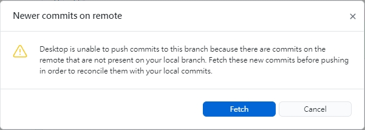

使用的工具 github desktop (沒有的同學請先安裝)

上傳的流程：
1. Fetch origin(確認伺服器上的版本與本地端同步)
2. Pull origin(把伺服器當前的版本更新到本地端)
3. 勾選需要的檔案(沒有要勾選默認是全部上傳)
4. 撰寫上傳標題(日期 + 姓名 + 事件名稱)
    例如：2022-12-18-老師-微軟切版
5. description(描述)，可再詳細敘述做的事情
6. 按下 Commit to xxxx (xxxx是上傳的分支名稱)
7. Push origin(上傳到伺服器)

※※※
若在第七步驟出現下圖的狀況

別急著按 FETCH
別急著按 FETCH
別急著按 FETCH

主要是因為你目前的檔案資料與伺服器的資料版本不一致，
才導致了上面的狀況。

解決方法
1. 先 Cancel 關掉此視窗
2. 點下左下角有一個 Undo (取消的按鈕)，這時會詢問你有沒有看取消這次的commit，請按下 Continue(繼續執行操作)
3. 之後再將上傳流程跑一次
※※※